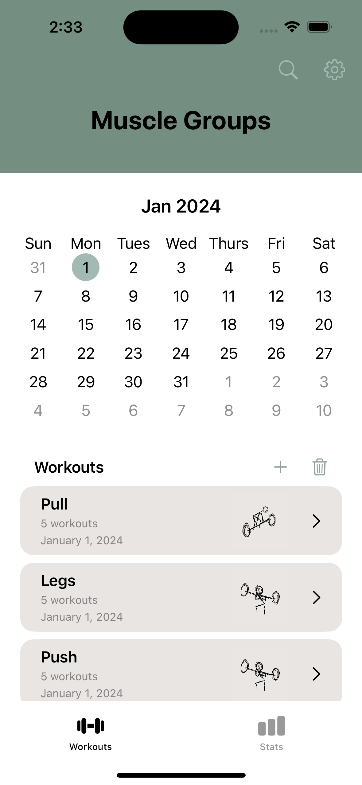

# GymTracker

Welcome to the Gym Tracker App. I designed this app during my second year of university and has been a passion project I've always wanted to do for myself since I started working out. The app allows you to create your workouts with whatever exercise you wish to add. Then, with your input, it tracks the weights and reps you have done for each exercise and using that data, it produces statistics for you to view and reflect on your progress. There is still more work that I wish to do on it but for now, if you wish to preview how the app looks on devices keep scrolling down.

Here is the main screen equipped with a calendar that highlights which days you have been to the gym and the area where you can create new workouts, in this preview I have already provided some examples. 

As you dive into your workouts you will be provided with the next screen where you can create new workouts and view a weight progression graph of each workout to see how much weight you've used for each workout over time.

// WORKOUT VIEW

Following your workout, you will then be presented with the final screen where you can implement your sets by inputting how much weight and how many reps you do for each set.

// SET VIEW

In the next tab, Stats, you can view the calendar that tracks which days you've gone to the gym and view all the weight progression graphs for all of your workouts.

